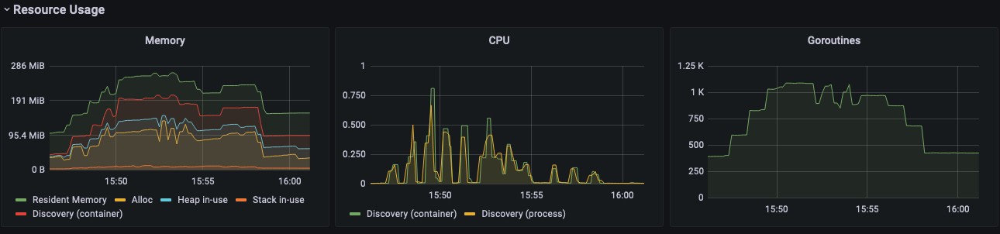
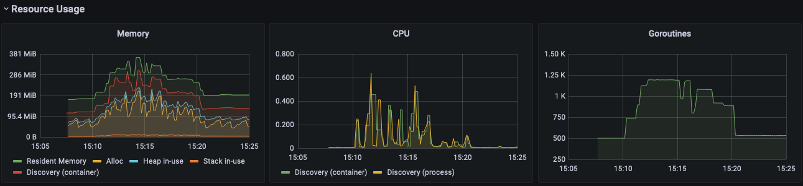

The test environment:
3-node kubernetes cluster, each node with the following spec:
   1. 4 vCPUs
   2. 2 core Intel Core Processor (Broadwell, IBRS), 2095.148 MHz, cache size 16384 KB
   3. 16 GB memory

Istio version tested 1.13.2

40 workload, each with the following spec:
   1. 3 Virtual services, 2 valid, 1 not valid.
   2. One gateway, and one destination rule.
   3. 5 pods, 4 pods are for services, 1 pod is for client to generate traffic

Each workload is created in one namespace.

No traffic cross workloads. Each workload create the designed services, pods, and
send requests to the services once it starts. Each workload runs for 5 minutes, then
workload will be removed. All 40 workloads will be created in a small time range like
in less than 1 minute.

Here are the results of the test:

With enableAnalysis=false

With enableAnalysis=true

Conclusions:
With flag on, the CPU consumptions do not increase, however the memory consumption
will jump about 50% comparing to when the flag is off. Number of the go routine will
also increase around 25% comparing to when the flag is off.
